# ========================================
# Purge Ring Simulation using VISSIM:
# ========================================

## 2-Stage Reuseable Launch Vehicle Purge Ring Simulation using VISSIM.

##
## I. Operation: "./VISSIM/LAPFWD_Purge_Ring_c.vsm"

##
## II. Purge Ring Top Level Diagram:

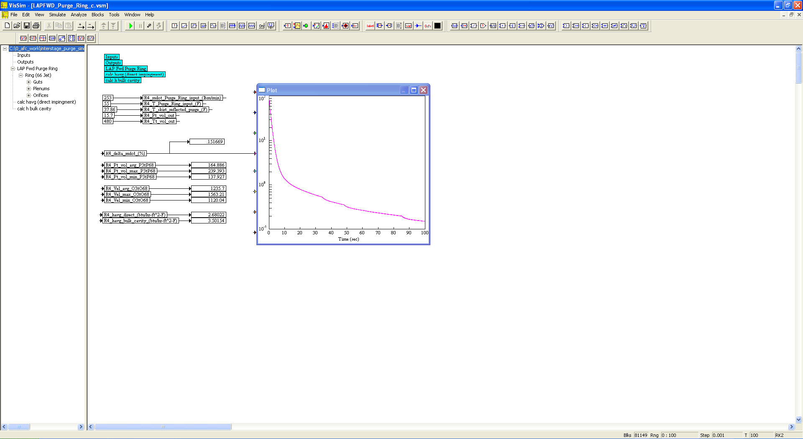

##
## III. Inputs Sub-System Level Diagram:

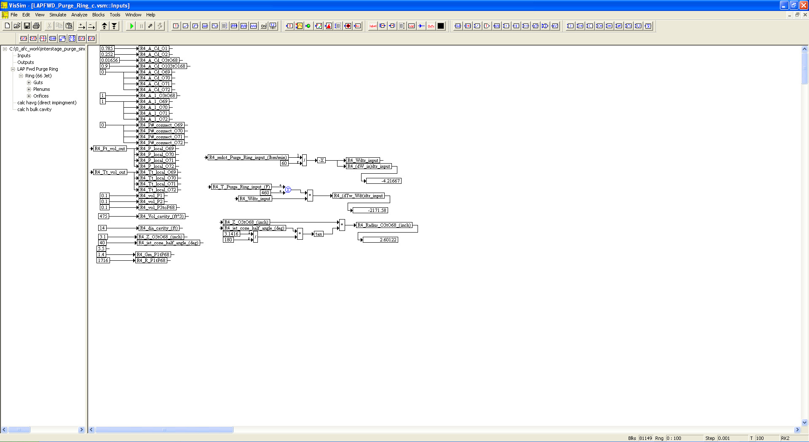
##
## IV. Outputs Sub-System Level Diagram:

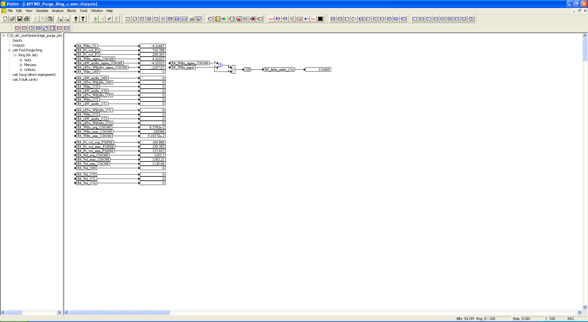
##
## V. Purge Ring Sub-System Level Diagram:

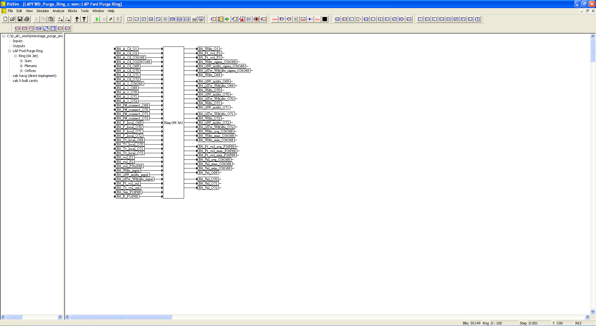
##
## VI. Purge Ring Interior Sub-System Level Diagram:

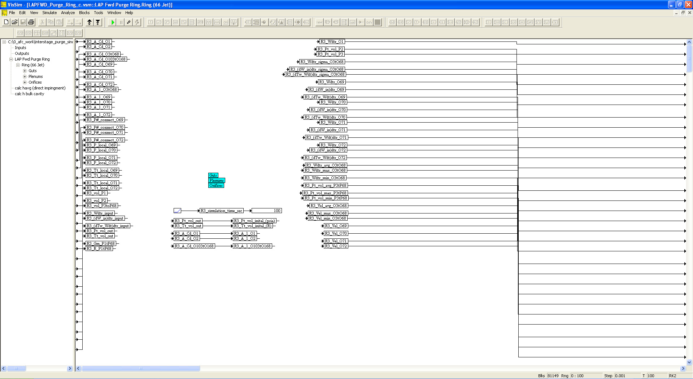
##
## VII. Purge Ring Inputs Sub-System Level Diagram:

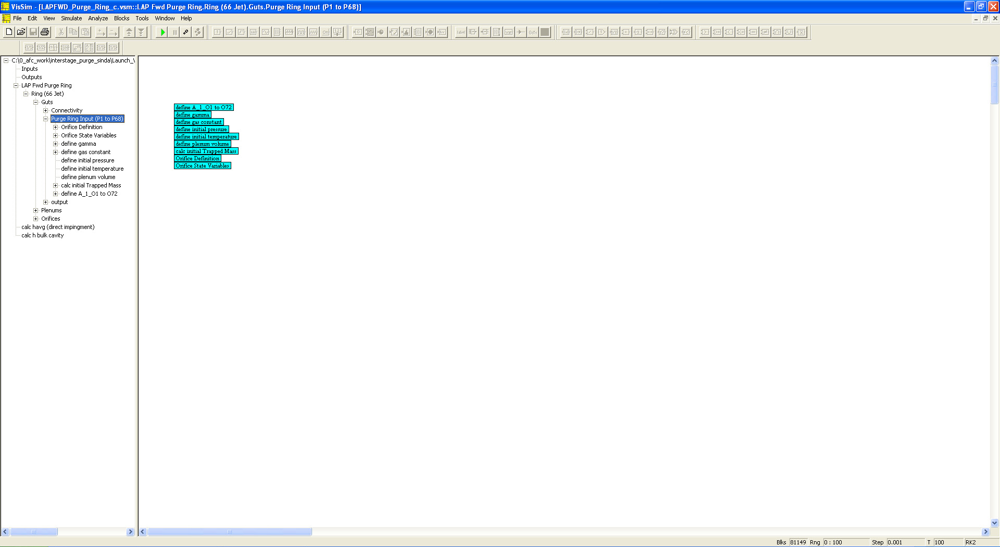
##
## VIII. Purge Ring Connectivity Sub-System Level Diagram:

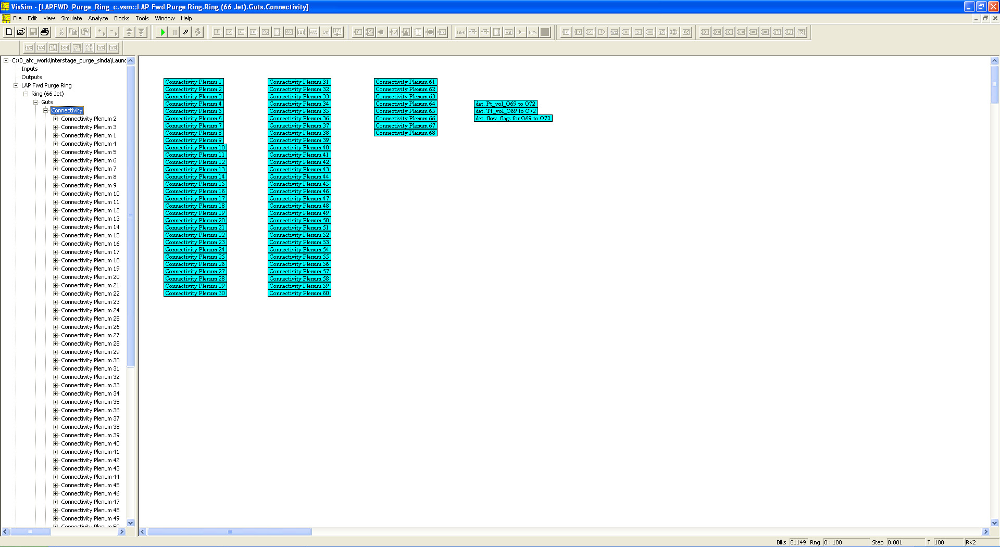
##
## IX. Purge Ring Output Sub-System Level Diagram:

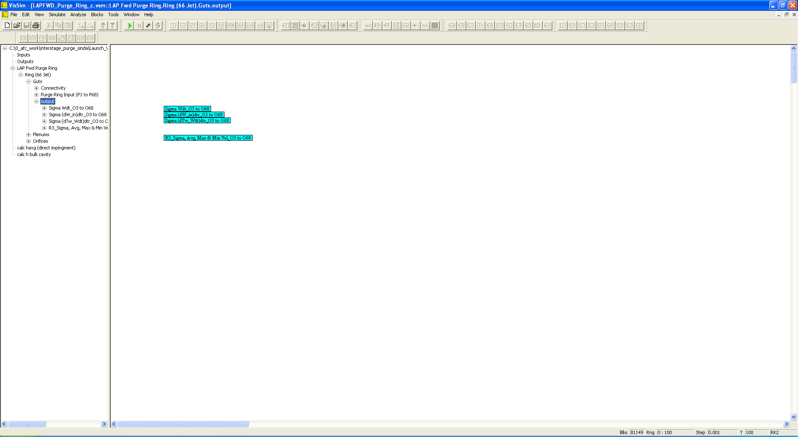
##
## X. Purge Ring Plenums Sub-System Level Diagram:

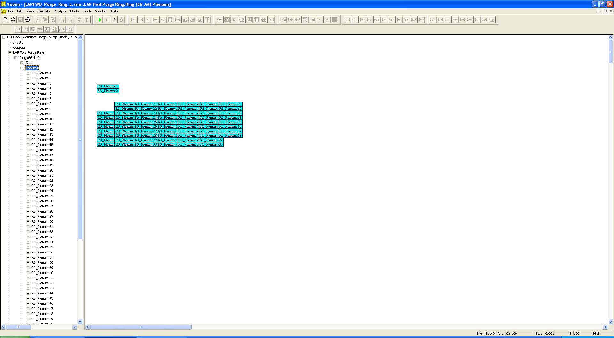
##
## XI. Plenum #1 Sub-System Level Diagram:

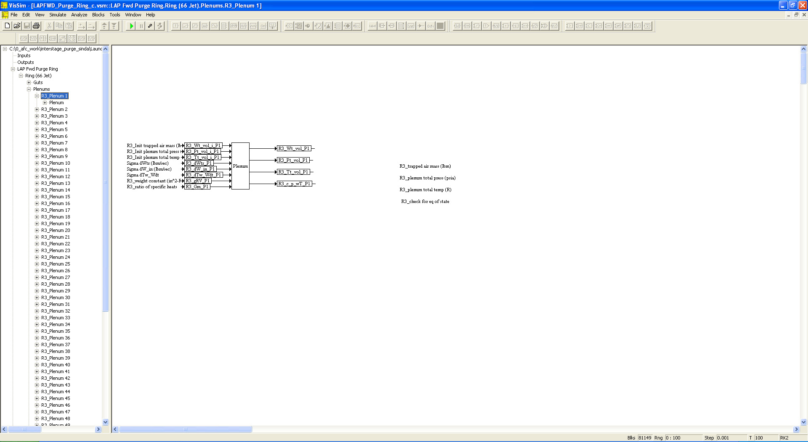
##
## XII. Orifices Sub-System Level Diagram:

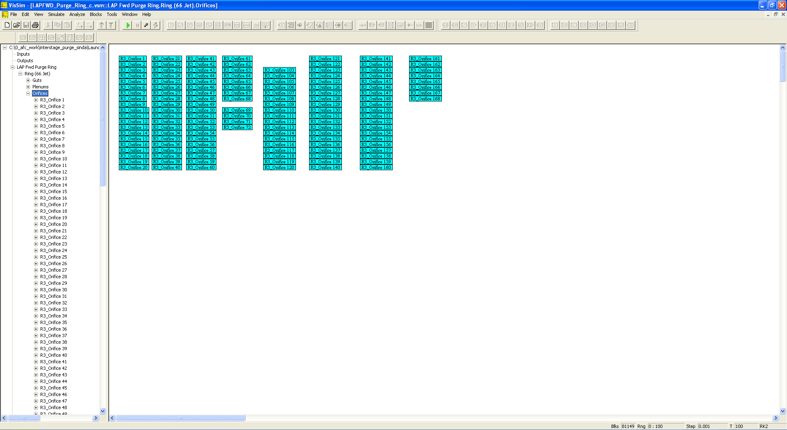
##
## XIII. Orifice #1 Sub-System Level Diagram:

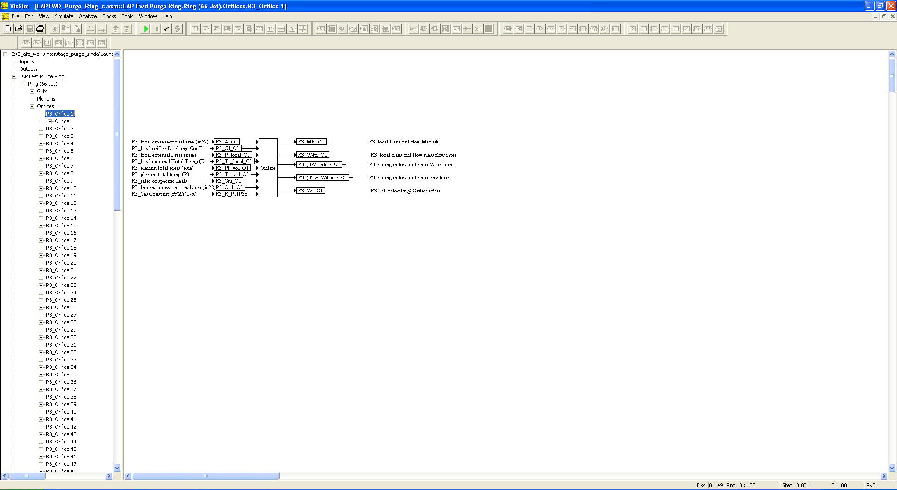
## 
## *Note: 
## 1. Performance Data and Analysis performed using VISSIM, ( https://web.solidthinking.com/vissim-is-now-solidthinking-embed )

